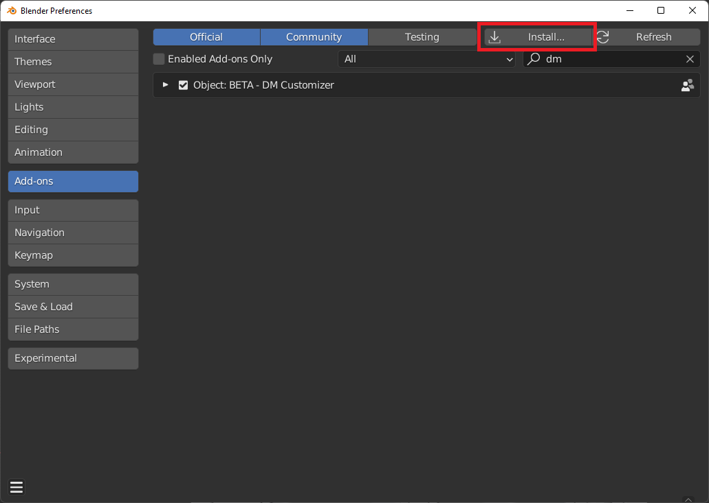
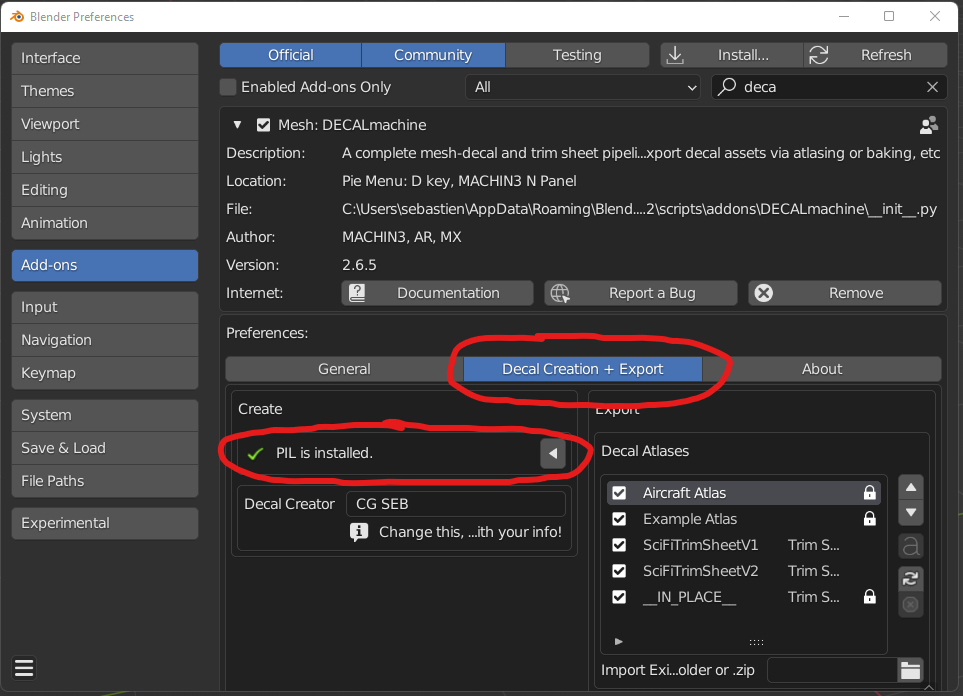

# 2. Installation

With DECALMachine installed (read <a href="https://machin3.io/DECALmachine/docs/" target="_blank">their doc</a> to install it), 
you can install DM Customizer.

There is no specific installation process, you can install it like any other Blender addon.

<figure markdown>
  { width="600" } 
  <figcaption>Blender preferences</figcaption>
</figure>

!!! info
    The `first time you open` the DMCustomizer Npanel it may be slow. This is totally normal, DMC is creating all it needs
    to work. `This will be slow only the first time` after you install DMC. **You have to restart Blender after that**

!!! info
    We do recommend downloading the zip file from where you bought the addon and directly import it into blender. 
    Unzipping the file is unnecessary

!!! warning
    Make sur `PIL` is installed by going into the DECALmachine preferences 

<figure markdown>
  { width="600" } 
  <figcaption>DECALmachine preferences</figcaption>
</figure>