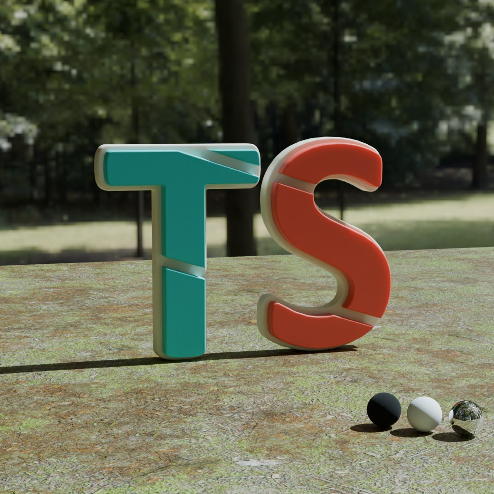
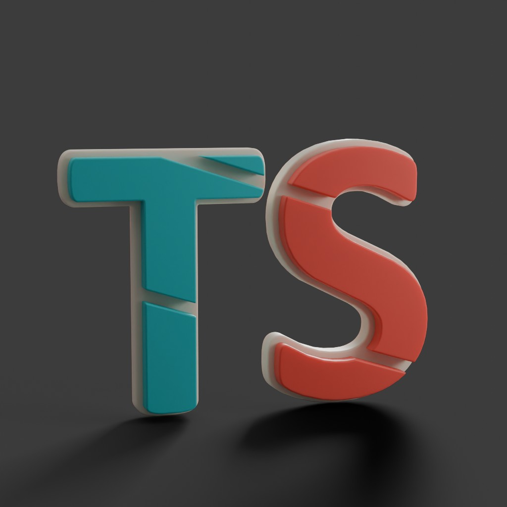
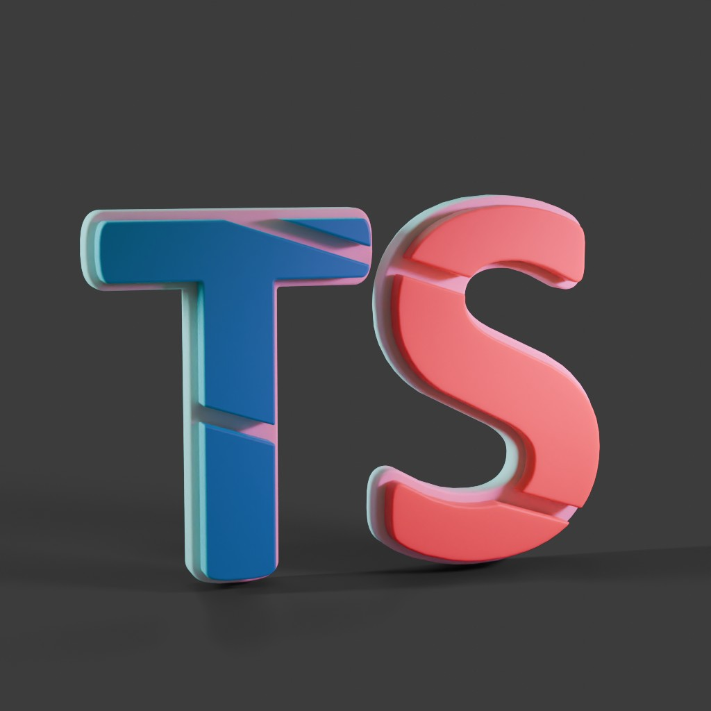
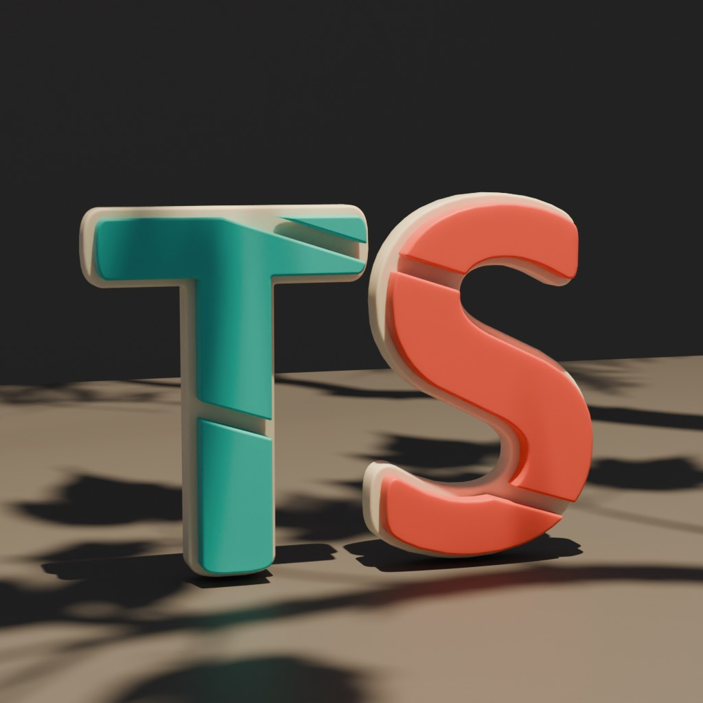
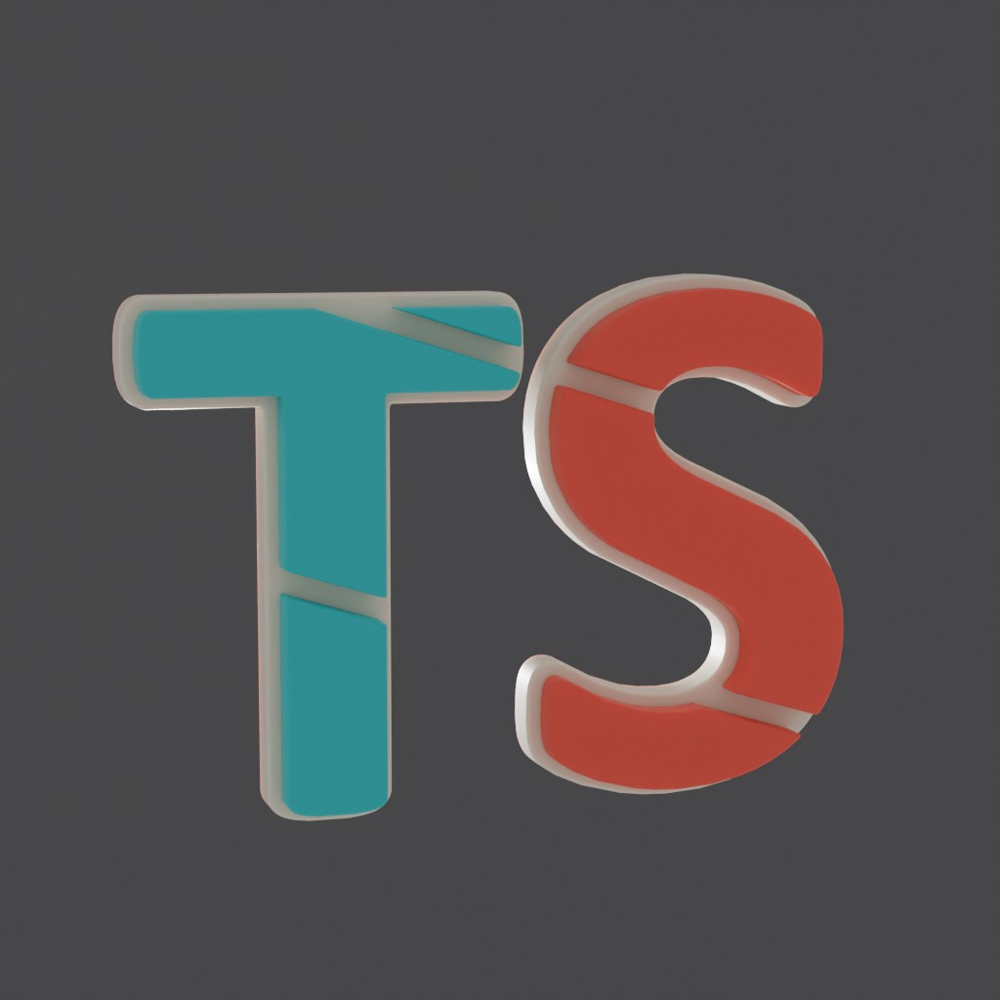
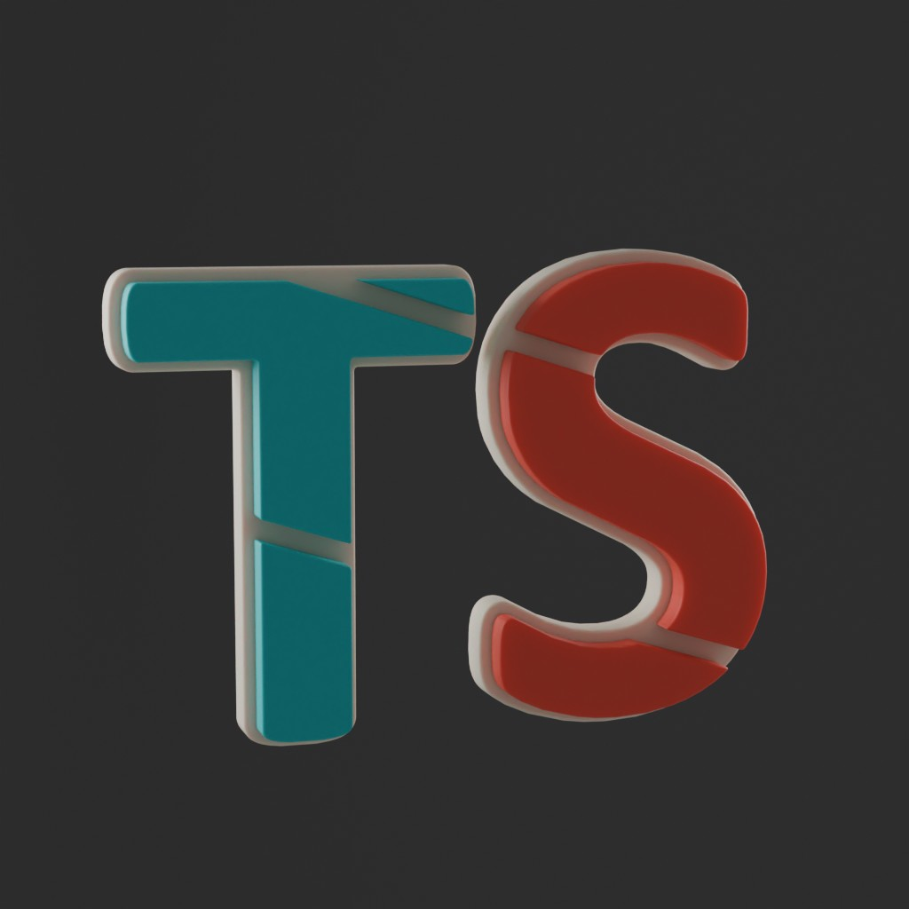
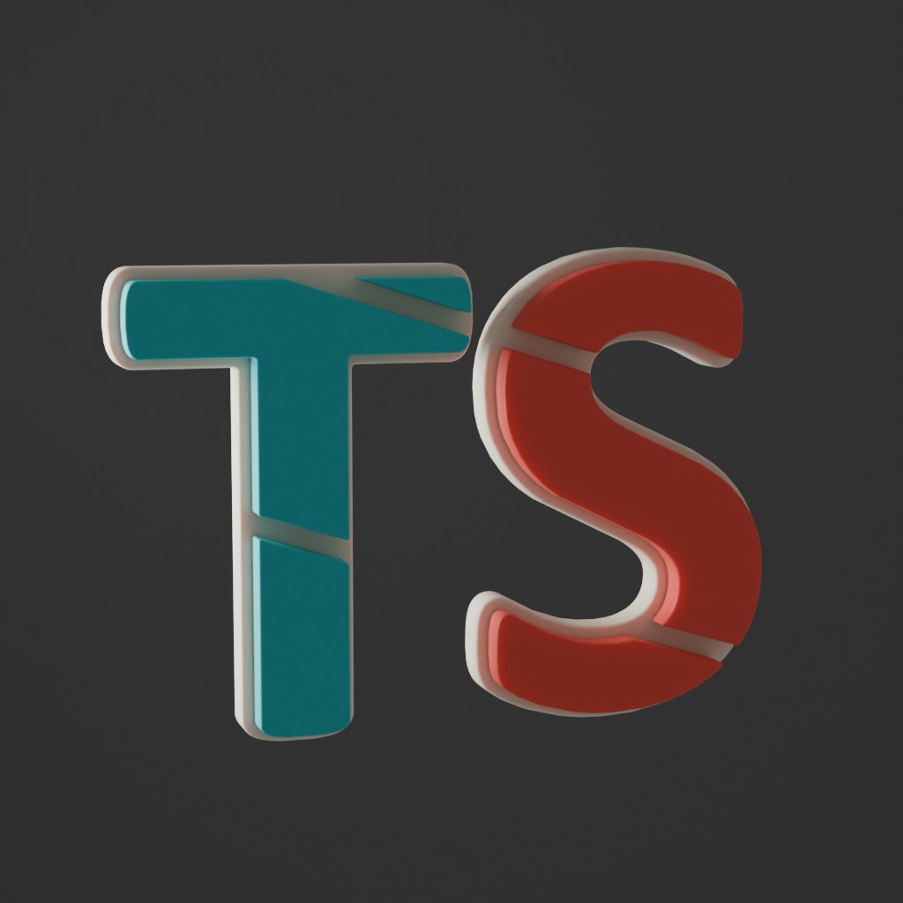
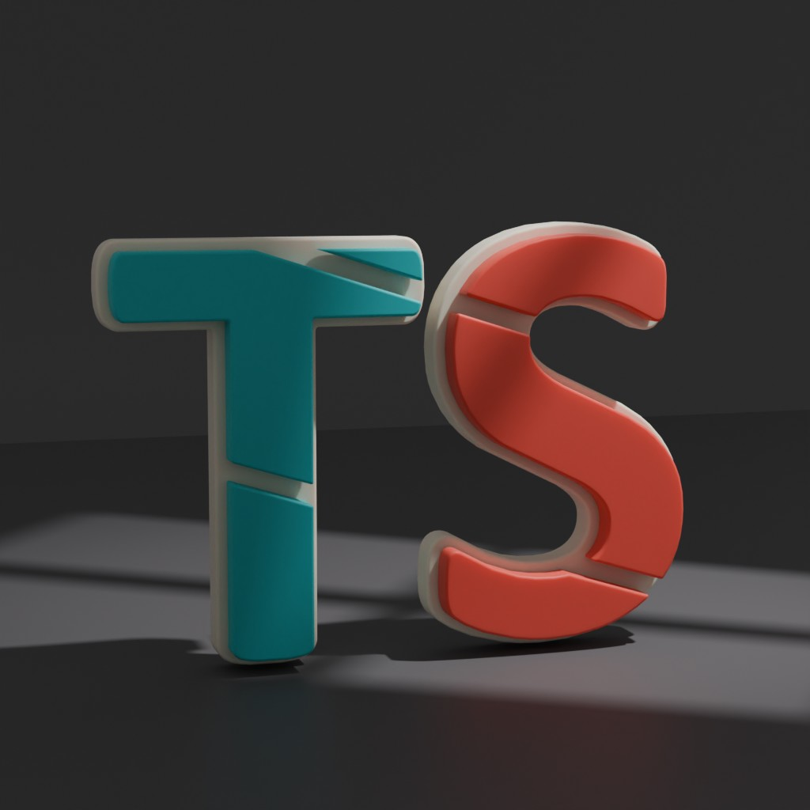

# 2. Studios and Lights Sets

There are multiple studios and light sets included with the addon.

## Studios
{: class="asset_image lite-asset"}
{: class="asset_image lite-asset"}
{: class="asset_image"}
{: class="asset_image"}
{: class="asset_image"}

## Light Sets
{: class="asset_image lite-asset"}
{: class="asset_image lite-asset"}
{: class="asset_image lite-asset"}
{: class="asset_image lite-asset"}
{: class="asset_image"}
{: class="asset_image"}
{: class="asset_image"}
{: class="asset_image"}
{: class="asset_image"}

<a href="https://blendermarket.com/products/texstudio-easy-texturing-studio" target="_blank" class="back-button">Go back to Blender Market ></a>

!!! warning
    Only the studios and light sets with a <strong style="color:#1F9DD3">blue border</strong> are included in the `Lite`{: style="color:#04c5ff"} version. If you choose the `Pro`{: style="color:#D31F20"} or `Ultimate`{: style="color:#AC34A0"} version, all the studios and lights are included.

!!! info
    You can't find a studio you like? [Create your own](7.create_studio.md) and import it into the addon!