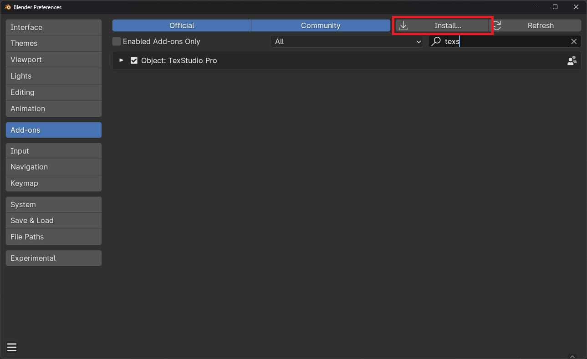
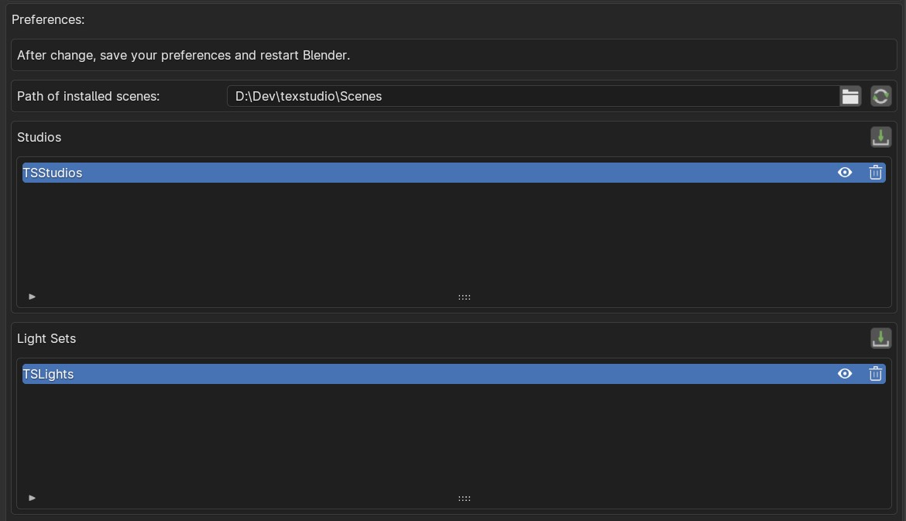

# 3. Installation

There is no specific installation process, you can install it like any other Blender addon.

<figure markdown>
  { width="600" } 
  <figcaption>Blender preferences</figcaption>
</figure>

Go to the preferences, click on install and select the addon Zip file named **addon_texstudio_x.x.x.zip** (where x.x.x is the latest version of the addon).

<figure markdown>
  { width="600" } 
  <figcaption>TexStudio preferences</figcaption>
</figure>

!!! info
    You can change where the Studios and Light setups are installed in the addon preferences -> "Path of installed scenes".

After the addon is installed, click on the import button { width="20" } of the "Studios" section.
In the popup, select the Zip file named **studios_textstudio_x.x.x.zip** (where x.x.x is the latest version of the addon).

Repeat the operation with the Light Sets, but this time select the Zip file named **lights_textstudio_x.x.x.zip**

!!! info
    If the Studios or Light Sets are not showing, click on the refresh button { width="20" } at the top of the preferences