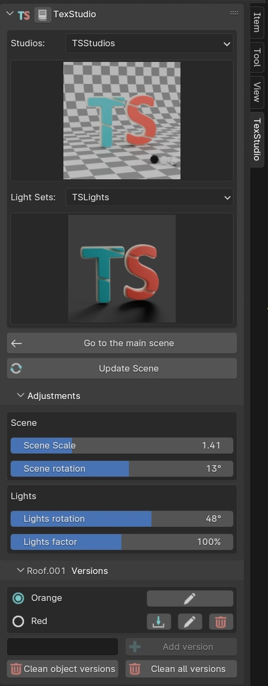

# 4. How it works?

TexStudio is providing a user interface in the `NPanel > TexStudio`. You will be able to import a full studio with a light set to texture your objects.

<figure markdown>
  { width="400" } 
  <figcaption>NPanel in the 3DViewport</figcaption>
</figure>

- Select the Studio
- Select the Light Set
- Select the object you want to texture
- Click on the `Import Selected Scene` button

!!! warning
    Rotating, moving or scaling the objects in `texturing mode` will also rotate, move or scale them in your main scene.
    Use the `Adjustments panel` instead.

## Update the scene

You would like to change the studio or the light set? Select them and click the `Update Scene` button { width="20" }

It will keep your objects and only update the studio and the lights.