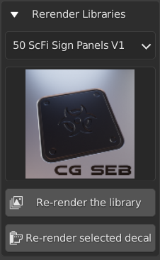
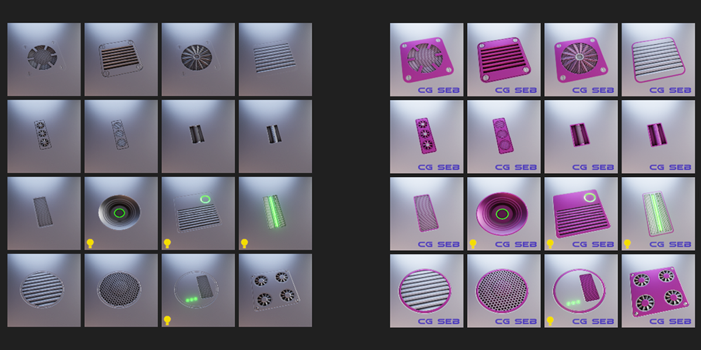
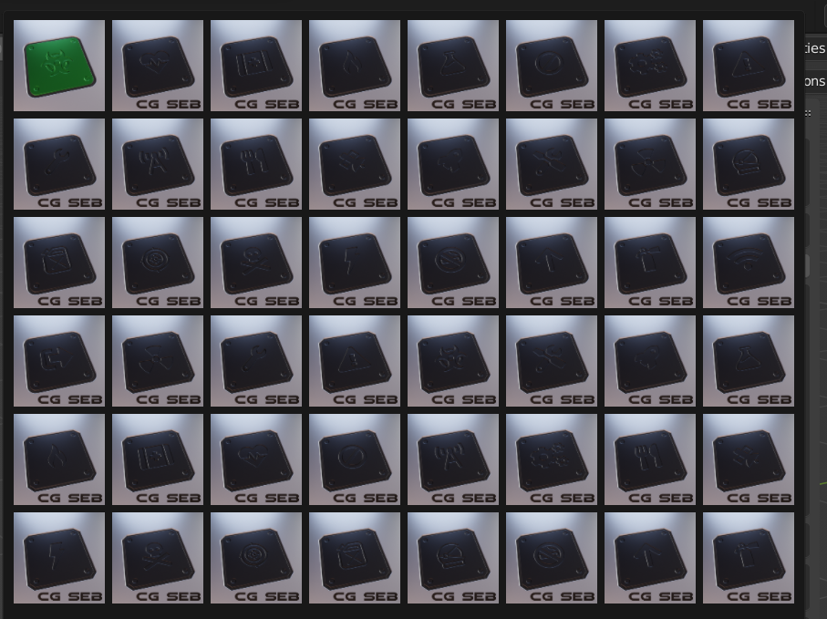

# 5. Re-render libraries
It's nice to be able to customize the baked decal, but what happens to your existing collections? Well there is 
feature in the Re-render tab of the addon!

<figure markdown>
  { width="400" } 
  <figcaption>Re-render libraries</figcaption>
</figure>

Select the library you want to re-render, click the `Re-render the library` button and DM Customizer will use its settings to update all the thumbnails of the selected 
library.

<figure markdown>
  { width="600" } 
  <figcaption>Re-rendered library</figcaption>
</figure>

# Re-render one single decal
What if you need to re-render only a specific decal? Well since the version **1.1.0** of DM Customizer it's possible!
Select the library, the decal and click the `Re-render selected decal` button.

<figure markdown>
  { width="600" } 
  <figcaption>Re-rendered selected decal</figcaption>
</figure>