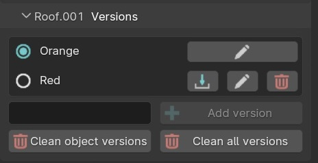
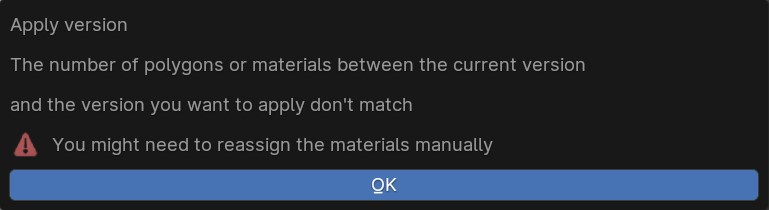

# 5. Versions

When you are in the texturing scene and an object is active, you are able to see the texture versions of this object.

<figure markdown>
  { width="400" } 
  <figcaption>Versions section</figcaption>
</figure>

You can create a new version of the object texture by entering a name and click on the `Add version` button.

Multiples actions are available :

-  { width="20" } Apply version
-  { width="20" } Rename version
-  { width="20" } Remove version

!!! info
    To see which version is currently active you will have this icon { width="20" }, the others { width="20" } are inactive.

## Good to know

A version is saving the materials and the material index of each polygon of the object. You may see this popup showing up when applying a version.

<figure markdown>
  { width="600" } 
  <figcaption>Warning popup when applying version</figcaption>
</figure>

This popup means the version you want to apply is not matching the version you already have.

-  Either the two versions (current and the one you want to apply) don't have the same number or materials
-  Or they don't have the same number of polygons (the geometry as changed)

No worries, you will still be able to apply the version if you click `OK`. You will probably (but maybe not) need to reassign the right material to the right faces.

!!! info
    If you want to clean you scene of **all the inactive versions**, click the `Clean all versions` button. If you want to do it only for the selected object, use
    the `Clean object versions` button.