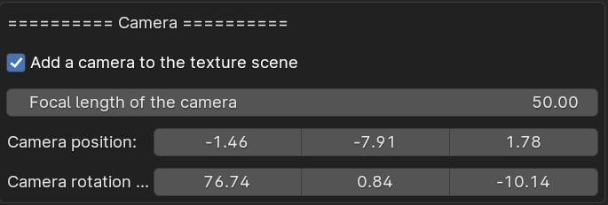

# 7. Studio Camera

By default, a studio camera is added to the texturing scene. You can disable it or change the settings in the preferences.

<figure markdown>
  { width="600" } 
  <figcaption>Camera settings</figcaption>
</figure>
