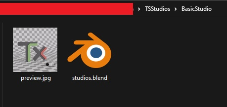

# 6. Studio Creation

Some studios are included with the addon, but anyone can create their own studios.

To create a studio, you need :

-  Open a new Blender project
-  Create a Collection named `TxStudio`
-  Put all the objects you need in your studio in this Collection (floor and other assets)
-  The floor of your studio has to be 13 meters by 13 meters. 

!!! warning
    The floor of your studio has to be named `StudioGround`.

File structure:

-  Folder with the name of you studio pack (can contain one or multiple studios)
-  Inside this folder, one folder per studio with the name of your studio
-  Inside the studio folder, the .blend file (named `studios.blend`) you created earlier
-  Inside the studio folder, a preview image 512x512px (at least) named `preview.jpg`

<figure markdown>
  { width="600" } 
  <figcaption>Studio Folder</figcaption>
</figure>

!!! warning
    The extension file of the preview has to be `.jpg`