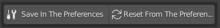

# 7. Extra tools

DM Customizer has some extra tools.

- The first one, will allow you to save the scene settings into the preferences. This way, 
you will be able to use those settings in another blender project.
- The Second one, will allow you to load the settings from the preferences into the scene (in a new scene the preferences 
are automatically loaded).

<figure markdown>
  { width="500" } 
  <figcaption>Extra tools</figcaption>
</figure>

!!! warning
    Saving to the preferences will erase the settings you had. Resetting from the preferences will erase you scene settings