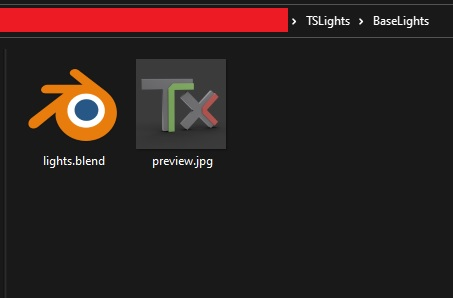

# 8. Light Set Creation

Some light sets are included with the addon, but anyone can create their own light sets.

To create a light set, you need :

-  Open a new Blender project
-  Create a Collection named `TxLights`
-  Put all the objects you need in your light set in this Collection
-  Make sure all the lights are correctly set (**light intensity, distance**) for a scene 13 meters by 13 meters

File structure:

-  Folder with the name of you light set pack (can contain one or multiple light sets)
-  Inside this folder, one folder per light set with the name of your light set
-  Inside the light set folder, the .blend file (named `lights.blend`) you created earlier
-  Inside the light set folder, a preview image 512x512px (at least) named `preview.jpg`

<figure markdown>
  { width="600" } 
  <figcaption>Light Set Folder</figcaption>
</figure>

!!! warning
    The extension file of the preview has to be `.jpg`