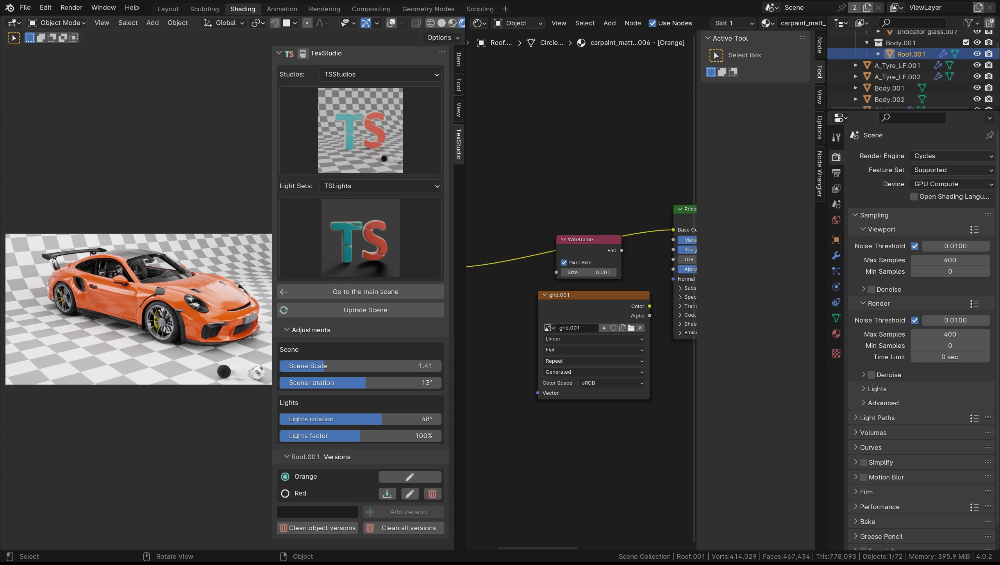

# 1. Welcome to TexStudio Documentation

**Current version : 2.0.0**

This Blender addon is made to provide you the best studios and light setups to texture and showcase your objects.

<figure markdown>
  { width="800" } 
  <figcaption>TexStudio</figcaption>
</figure>

# Introduction
With this addon you will be able to import a studio and a light setup to texture your object directly inside you current blender project.

No need to texture you objects in separate files. Select the object, select the studio and light setup and click on the import button and you are ready to texture.

!!! warning
    The addon works with Blender version **4.0 and greater** only

# Versions
Thanks to the versioning system in TexStudio, you can create multiple version of an object texturing. 

# Where to find us?

<a href="https://discord.gg/7B5wT8bQBD" target="_black">{ width="150" }</a>
<a href="https://www.youtube.com/c/CGSeb-scifi" target="_black">{ width="150" }</a>
<a href="https://twitter.com/CGSebSciFi" target="_black">{ width="150" }</a>
